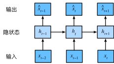

# RNN

## 应用场景

* 时间序列预测
  * 2, 4, 6, 8, 10 ... 预测偶数
  * 股市波动预测
  * 物体温度曲线预测
* 股票价格预测（富时100指数）
    
    $x_t ~ P(x_t|x_{t-1}, ..., x_{1})$
    即$x_t$与$x_{t-1}, ..., x_{1}$有关

## 训练方法

* 自回归模型
  * 假设$x_t$仅仅与其前$\tau$个变量有关
  * $x_t ~ P(x_t|x_{t-1}, ..., x_{t-\tau})$
* 隐变量自回归模型
  * 将$x_1, ... , x_{t-1}$总结为$h_t$
  * $\hat{x_t} = P(x_t|h_t)$来估计$x_t$
  * $h_t = g(h_{t-1}, x_{t-1})$
    

  
  